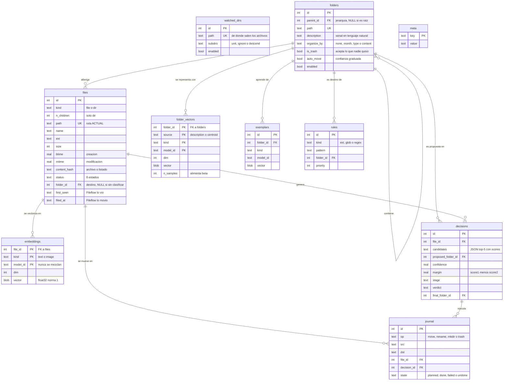

# Diagrama relacional

Diagrama entidad-relación del índice de Fileflow. El DDL que lo implementa está en
[`fileflow/db/schema.sql`](../../fileflow/db/schema.sql) y el razonamiento detrás de cada
tabla, en [esquema de datos](../referencia/esquema-de-datos.md).

> GitHub renderiza este diagrama automáticamente. En VS Code hace falta una extensión de
> Mermaid para verlo dibujado; sin ella se muestra como código.

## Cómo leerlo

**`folders` y `files` son los dos centros de gravedad.** Todo lo demás cuelga de uno de los
dos, salvo `journal`, que cuelga de ambos porque registra precisamente el acto de unirlos:
mover un archivo a una carpeta.

**`watched_dirs` y `meta` son islas**, sin ninguna relación. Es correcto y deliberado:
`watched_dirs` dice *de dónde* vienen los archivos y `folders` *a dónde* van. Son conceptos
distintos aunque ambos guarden rutas.

**Las claves primarias compuestas cuentan la historia importante.** En `embeddings` la clave
es `(file_id, kind, model_id)`, no solo `file_id`. Eso permite que un mismo archivo tenga a
la vez su vector de `e5-small` y el de `bge-m3` sin pisarse, que es lo que hace posible
cambiar de perfil de hardware sin borrar el índice entero. Lo mismo en `folder_vectors`,
donde `source` separa la descripción del centroide: las dos señales del scoring.
