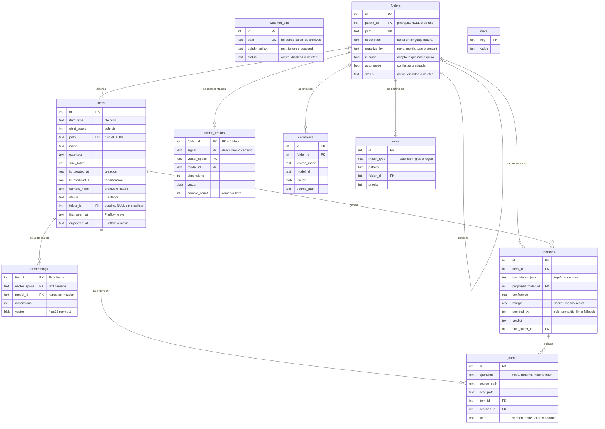

# Diagrama relacional

Diagrama entidad-relación del índice de Fileflow. El DDL que lo implementa está en
[`fileflow/db/schema.sql`](../../fileflow/db/schema.sql) y el razonamiento detrás de cada
tabla, en [esquema de datos](../referencia/esquema-de-datos.md).

> GitHub renderiza este diagrama automáticamente. En VS Code hace falta una extensión de
> Mermaid para verlo dibujado; sin ella se muestra como código.

> **Fileflow no hace `DELETE` de sus propias entidades.** `items`, `folders` y
> `watched_dirs` se dan de baja con `status`, nunca se borran. Por eso el diagrama no
> tiene relaciones de borrado en cascada como camino normal: las cláusulas `ON DELETE`
> están como red de seguridad, no como mecanismo previsto.

## Cómo leerlo

**`folders` e `items` son los dos centros de gravedad.** Todo lo demás cuelga de uno de los
dos, salvo `journal`, que cuelga de ambos porque registra precisamente el acto de unirlos:
mover un archivo a una carpeta.

**`watched_dirs` y `meta` son islas**, sin ninguna relación. Es correcto y deliberado:
`watched_dirs` dice *de dónde* vienen los archivos y `folders` *a dónde* van. Son conceptos
distintos aunque ambos guarden rutas.

**El `status` sustituye al borrado.** Quitar una carpeta no destruye lo que Fileflow
aprendió de ella: al volver a añadirla se reactiva la misma fila y recupera su centroide,
sus ejemplares y su historial de decisiones. Hay además un motivo técnico — SQLite
reutiliza los identificadores de las filas borradas, así que con borrado duro una carpeta
nueva podría heredar los vectores de una anterior sin que nada fallara.

**Las claves primarias compuestas cuentan la historia importante.** En `embeddings` la clave
es `(item_id, vector_space, model_id)`, no solo `item_id`. Eso permite que un mismo archivo tenga a
la vez su vector de `e5-small` y el de `bge-m3` sin pisarse, que es lo que hace posible
cambiar de perfil de hardware sin borrar el índice entero. Lo mismo en `folder_vectors`,
donde `signal` separa la descripción del centroide: las dos señales del scoring.
